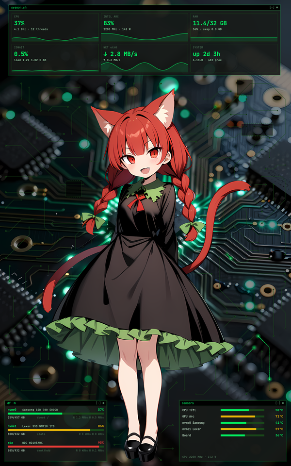

# PiwnicaStyleDashboard

An animated **PCB desktop layer** with a **system dashboard** for Arch Linux (X11): faint circuit
traces over your wallpaper, signal pulses running along them with a green afterglow, and
terminal-style panels showing CPU, GPU, RAM, IOWait, network, system, physical disks and temperatures.
It lives under your windows and above the wallpaper, lets every click through to the desktop,
and **keeps off the character on your wallpaper** (holdout mask).

<p align="center"></p>

*Screenshot rendered with `piwnica-dashboard screenshot --demo` (fake data), wallpaper from `examples/orin`.*

## Features

- **Adapts to the machine by itself** — nothing to configure for a typical setup:
  - monitor: the first **portrait** monitor gets the dashboard (else the primary one); the others get the traces only;
  - GPU: **Intel** (i915 / xe, engine load from DRM fdinfo like `intel_gpu_top`), **AMD** (amdgpu sysfs),
    **NVIDIA** (`nvidia-smi`), picking the card that drives a display;
  - network: the interface with the default route;
  - disks: real disks from `lsblk` (no loop/zram/removable), usage in % and GB, read/write rate;
  - temperatures with **limits and colour zones**: green = idle/light work, yellow = normal under load,
    red = close to the limit (not recommended for long periods). Limits come from the hardware
    (Intel TjMax, amdgpu `temp*_crit`, NVIDIA slowdown temp) or vendor specs (AMD CPUs 90 °C,
    Intel Arc 90 °C, NVMe min(70 °C, drive WCTEMP)), each overridable.
- **Holdout**: give it a PNG mask (alpha = character) and neither the animation, the tint nor the panels
  touch that area; the panels are placed in the free space around the character, or skipped if there is none.
- **Cheap**: only changed areas are repainted (~30 fps), rendered client-side so the X server only copies
  them; data is sampled once per second, slow sensors every 5 s. About 20 % of one CPU core for three
  monitors with the dashboard (plus ~4 % in Xorg). **While a game runs** (Steam/Proton, Lutris, Heroic/Wine,
  gamescope -- even windowed or alt-tabbed) or a fullscreen window has focus, the traces on the other monitors
  switch off and the **dashboard keeps running**, to watch the game's load (`dashboard_in_games = false` to stop it too).
- **Click-through**, in the "below" window layer: desktop icons and the desktop menu keep working.

## Requirements

Arch Linux, an X11 session with a **compositing** window manager (XFCE: *Window Manager Tweaks → Compositor*;
elsewhere e.g. `picom`). Wayland is not supported.

```sh
sudo pacman -S --needed python python-gobject python-cairo python-numpy gtk3 xorg-xprop ttf-jetbrains-mono
```

## Install

User-local, no sudo:

```sh
git clone https://github.com/arikukaenbyou/PiwnicaStyleDashboard.git
cd PiwnicaStyleDashboard
./install.sh            # runs the tests, installs to ~/.local, autostarts on login, starts now
./install.sh --remove   # uninstall
```

System-wide package: `cd packaging && makepkg -si` (after a release tag exists).

## Usage

```sh
piwnica-dashboard detect      # what was detected: monitors, holdouts, GPU, network, disks, sensors + limits
piwnica-dashboard run         # start (the autostart entry does this on login)
piwnica-dashboard screenshot --demo out.png --wallpaper wall.png --holdout holdout.png
```

Configuration: `~/.config/piwnica-dashboard/config.toml` is written on first start with every value set to
`auto` and commented. Set a monitor by connector name (`monitor = "DP-1"`), a holdout path, or a temperature
limit (`cpu_limit = 95`) when the automatic guess is wrong.

### Holdout mask

A PNG with **exactly the monitor's size**; alpha > 0 where the character is (a soft, blurred edge looks best).
With `path = "auto"` (default) it is looked up as `holdout-<W>x<H>.png` **next to the monitor's XFCE wallpaper**,
so keeping the wallpaper and its mask in one folder is enough. See `examples/orin/` for a pair.

## Tests

```sh
python -m unittest discover -s tests -t .
```

The collectors are tested on fake `/proc` and `/sys` trees (Intel i915/xe, AMD, NVIDIA, Intel and AMD CPUs,
NVMe, Super I/O), plus monitor choice, config, panel layout around the example character and the rendered
frame (nothing is drawn over the character). CI runs them in an Arch Linux container.

## Licence

MIT, see [LICENSE](LICENSE). The example wallpaper has its own note in [examples/orin](examples/orin/README.md).

---

## Po polsku

**PiwnicaStyleDashboard** to animowana warstwa pulpitu dla Arch Linuksa (X11). Na tapecie rysuje ścieżki
płytki drukowanej z impulsami i zielonym afterglow, a do tego panele w stylu terminala: CPU, GPU, RAM,
IOWait, sieć, system, dyski fizyczne (% i GB) oraz temperatury. Warstwa leży pod oknami, przepuszcza
kliknięcia i omija postać na tapecie (maska holdout).

- **Sama się dopasowuje:** dashboard trafia na pierwszy pionowy monitor, GPU Intel, AMD i NVIDIA są
  rozpoznawane automatycznie, sieć to interfejs z trasą domyślną, dyski to fizyczne dyski z `lsblk`.
- **Temperatury z progami:** zielony to spoczynek, żółty to norma pod obciążeniem, czerwony to blisko
  limitu. Limity pochodzą ze sprzętu albo ze specyfikacji producenta i można je nadpisać w configu.
- **Instalacja:** `./install.sh` bez sudo (zależności wypisze do `sudo pacman -S …`).
  Diagnostyka: `piwnica-dashboard detect`. Konfiguracja: `~/.config/piwnica-dashboard/config.toml`.
- **Gry:** gdy działa gra (Steam/Proton, Lutris, Heroic/Wine, gamescope), także w oknie i po Alt+Tab,
  animacja na pozostałych monitorach się wyłącza, a dashboard działa dalej (`dashboard_in_games = false`, żeby też gasł).
- **Maska postaci:** PNG w rozmiarze monitora, gdzie alfa > 0 oznacza postać. Plik
  `holdout-<szer>x<wys>.png` obok tapety XFCE jest wykrywany sam. Przykład jest w `examples/orin/`.
